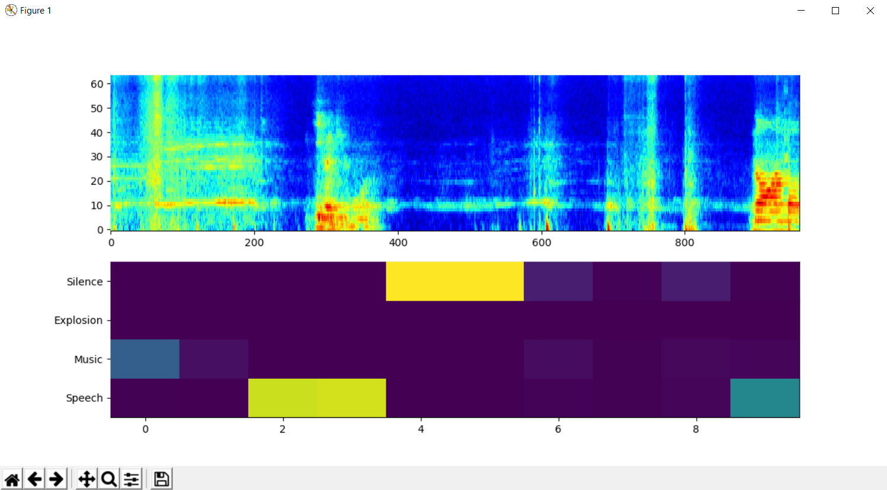

# Real-Time Sound Event Detection

This repository contains the python implementation of a Sound Event Detection system working in real time. 



## Getting started

Execute the following commands to setup you project.

```bash 
git clone https://github.com/robertanto/Real-Time-Sound-Event-Detection.git
cd Real-Time-Sound-Event-Detection
pip3 install -r requirements.txt
```

At this point you have only to execute the demo by running the following command:

```bash 
python3 ./sound_event_detection.py
```

### Change the classes to detect

To modify the classes to visualize in the plot, change the event's ids in the file `sound_event_detection.py` at the line 16:

```python
plt_classes = [0,132,420,494] # Speech, Music, Explosion, Silence 
```

You can find the full list of 521 audio events in `keras_yamnet\yamnet_class_map.csv`. It follows the list of the first 50 audio events:

    0, Speech
    1, Child speech, kid speaking
    2, Conversation
    3, Narration, monologue
    4, Babbling
    5, Speech synthesizer
    6, Shout
    7, Bellow
    8, Whoop
    9, Yell
    10, Children shouting
    11, Screaming
    12, Whispering
    13, Laughter
    14, Baby laughter
    15, Giggle
    16, Snicker
    17, Belly laugh
    18, Chuckle, chortle
    19, Crying, sobbing
    20, Baby cry, infant cry
    21, Whimper
    22, Wail, moan
    23, Sigh
    24, Singing
    25, Choir
    26, Yodeling
    27, Chant
    28, Mantra
    29, Child singing
    30, Synthetic singing
    31, Rapping
    32, Humming
    33, Groan
    34, Grunt
    35, Whistling
    36, Breathing
    37, Wheeze
    38, Snoring
    39, Gasp
    40, Pant
    41, Snort
    42, Cough
    43, Throat clearing
    44, Sneeze
    45, Sniff
    46, Run
    47, Shuffle
    48, Walk, footsteps
    49, Chewing, mastication
    50, Biting
